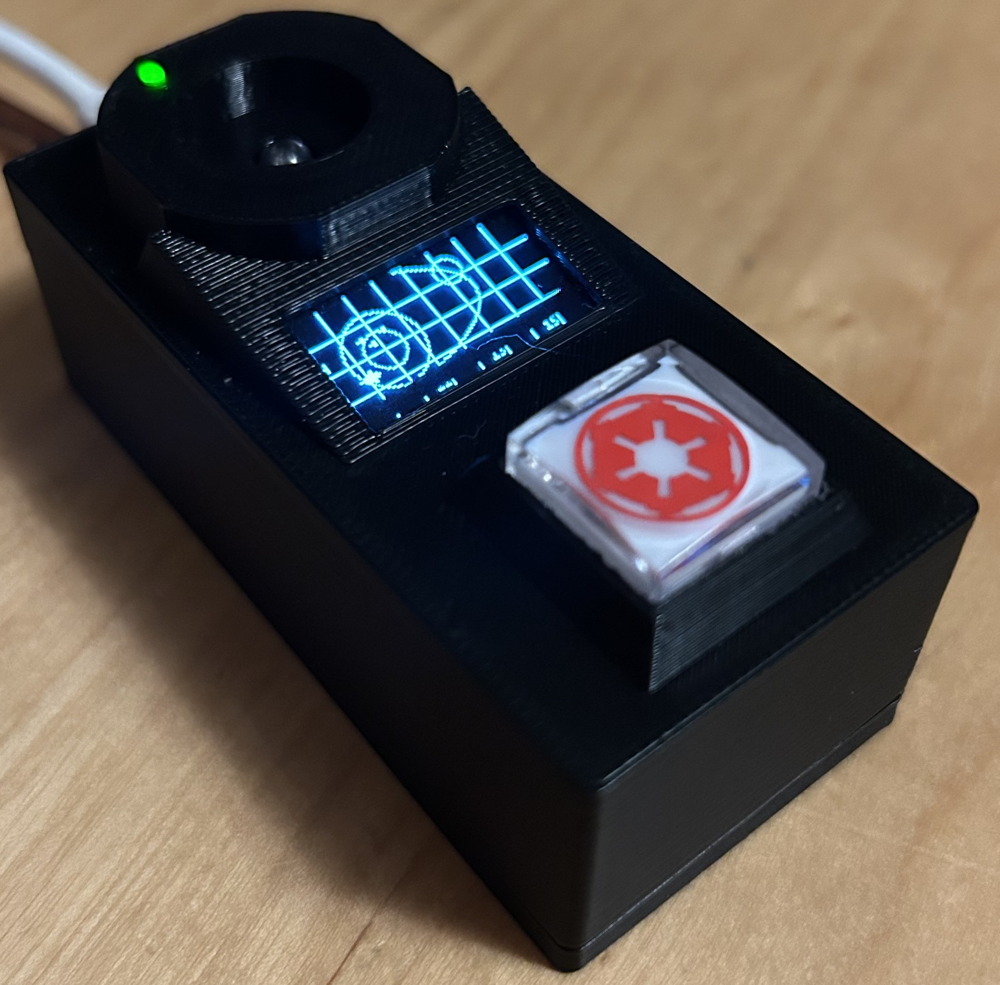
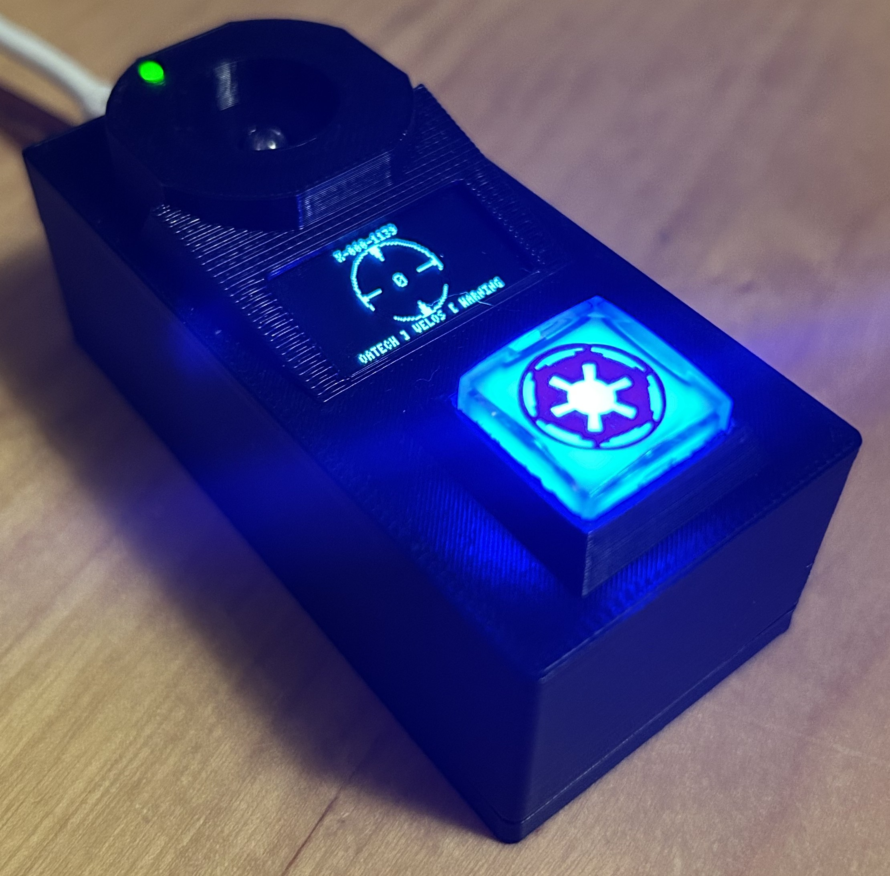
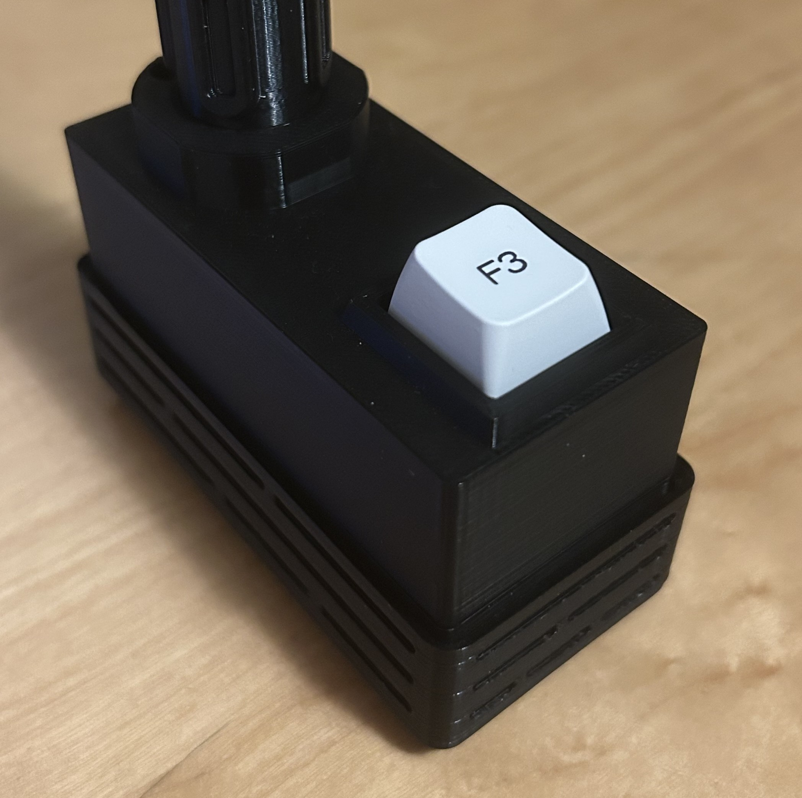
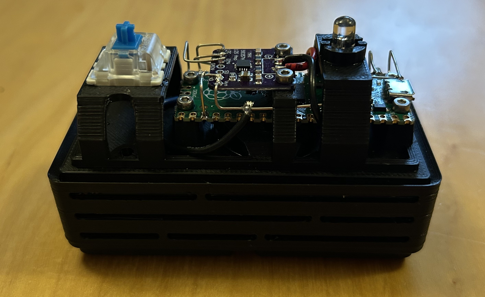
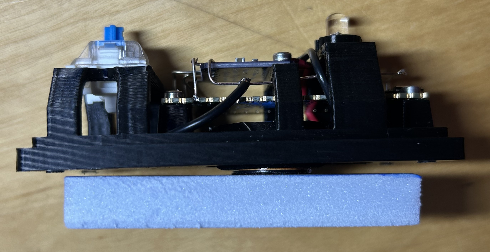

# imperial audio console

See related repo: <https://github.com/ronzinante/insertfinity>

## Build (Mk2)

- Raspberry Pi Pico microcontroller
- 0.96" OLED display
- MP3 audio playback via MAX98357A
- 3W Dayton audio exciter
- Control button reminiscent of Death Star consoles
- Star Wars inspired design, interface and alerts

## Iterations history

### Mk2

Video: <https://www.youtube.com/@iwantcolorsback>

Code: [mk2](mk/mk2/)

*Map*

*Selection mode activated*

Design wins and features:

- Design was improved to resemble Star Wars universe.
- The exciter is now externally mounted and can be attached to a suitable resonant surface oriented toward the listener.
- Illuminated pushbutton with **Galactic Empire emblem**. The pushbutton style evoke the Death Star control console (ISI/Grass Valley Switcher).
- Selection mode with single pushbutton.
- Dynamic 0.96" display. **U8G2** is used for the display.
- Raspberry Pi Pico built in LED is exposed externally using 1.75mm transparent PLA filament.
- LittleFS
- Arduino-pico
  
Design fails:

- Almost no storage for additional song. Only Raspberry Pi Pico was used for storage.
- No access to BOOTSEL button.
- Requires USB connection for power

#### Bill of materials Mk2

| Link | Description | Quantity | Manufacturer |
| ------ | ------------- | ---------------- | ---------------- |
| [mk2](https://github.com/ronzinante/insertfinity/tree/main/stl/insert/insert-pedestal-star-wars-mk2) | STL part for 3D printing | - | - |
| - | Raspberry Pi Pico | 1 | Raspberry |
| - | Amplifier MAX98357A | 1 | - |
| - | DAEX13CT-4 Coin Type 13mm Exciter 3W 4 Ohm | 1 | Dayton Audio |
| - | Illuminated pushbutton PB26-13M | 1 | Honyone |
| - | Oled 0,96" I2C | 1 | - |
| - | T1 3/4 LED clear red | 1 | - |
| - | Straw | 1 | - |

### Mk1

Video: <https://www.youtube.com/@iwantcolorsback>

Code: [mk1](mk/mk1/)

*External*

*Internals*

*Exciter and foam panel*

Design fails:

- Boring design. Only the upper part resembles Star Wars.
- Nonoptimal sound reproduction. Exciter is located and oriented improperly. The foam panel is not facing the listener but is facing downward.
- Complex audio management. Both Micropython and Circuitpython have limitations.
- Almost no storage for additional audio effects. Only Raspberry Pi Pico was used for storage.
- Assembly issue caused by poor design choice.
- Requires USB connection for power
- No access to BOOTSEL button.

#### Bill of materials Mk1

| Link | Description | Quantity | Manufacturer |
| ------ | ------------- | ---------------- | ---------------- |
| [mk1](https://github.com/ronzinante/insertfinity/tree/main/stl/insert/insert-pedestal-star-wars-mk1) | STL part for 3D printing | - | - |
| - | Raspberry Pi Pico | 1 | Raspberry |
| - | Amplifier MAX98357A | 1 | - |
| - | DAEX13CT-4 Coin Type 13mm Exciter 3W 4 Ohm | 1 | Dayton Audio |
| - | Illuminated pushbutton PB26-13M | 1 | Honyone |
| - | T1 3/4 LED clear red | 1 | - |
| - | Straw | 1 | - |
